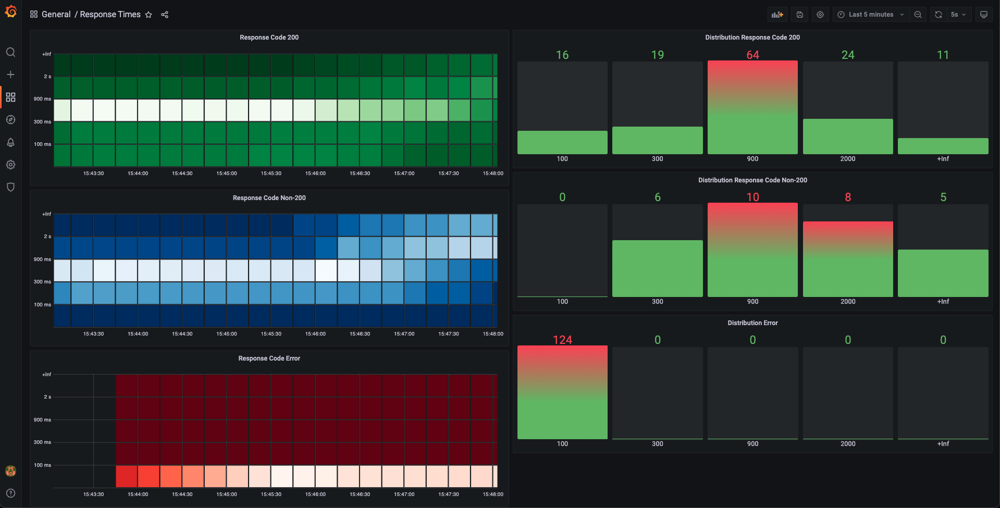

# Network Monitor
Despite its flaky name, this project's aim is to be a lightweight tool which regularly checks an HTTP endpoint and serves the response metrics from its `/metrics` endpoint ready to be consumed by prometheus.

## Configuration
The application accepts the following configuration values.
| KEY               | DESCRIPTION       | OPTIONAL | DEFAULT VALUE |
|-------------------|-------------------|----------|---------------|
| TARGET_ADDR       | The endpoint to check to with the format `protocol://uri` | false | none |
| BASE_URL          | The address which the application would be bound | true | `localhost:5600` |
| CHECK_FREQUENCY   | The duration between the latest response and the next request in seconds. Note that (despite its name) the application will not make a new request every `CHECK_FREQUENCY` seconds to not to choke the target service in case of a trouble on its side | true | 1 |
| BUCKETS           | The buckets of response durations (in milliseconds) to be grouped together (more on this in Metrics chapter) | true | 0.1, 0.5, 1 |

The application uses [gonfig package](https://github.com/serdarkalayci/gonfig) to read its configuration values. Using gonfig's ability to add more than one configuration source in the order to override the previous ones, the application currently reads its configuration from [config.json](src/config.json) file which is overriden by environment variables if supplied.

## Metrics
### response_times
This metrics contain the response code and the duration between the request and the response. This data is stored as a `histogram vector` using the buckets specified in the configuration and the labels `ResponseCode` which obviously contain the Response Code returned and `Error` which is a boolean value if the request errored or not. So it's possible to get duration of requests which got a spesific http response code in return, or all the requests which are nor errored and so on.

Note that the error mentioned here is not an erroneous response code like 50x, this is an error if `http.Get` method returns one.

From the http package documentation:

_An error is returned if there were too many redirects or if there was an HTTP protocol error. A non-2xx response doesn't cause an error. Any returned error will be of type *url.Error. The url.Error value's Timeout method will report true if the request timed out._

### error_messages
In case of an error another metric, with the data type `counter`  with one label `ErrorMessage`. So it's possible to get the count each unique error message.

## Installation and Usage
The repo contains a [dockerfile](prometheus/dockerfile) and [prometheus.yml](prometheus/prometheus.yml) file in the [prometheus](prometheus/) folder which is used to build a prometheus image with the scrape configuration targeted to our service.

There is another [dockerfile](src/dockerfile) which builds our project and place the executable inside a `alpine` base image which also installs ca-certificates to prevent false positive SSL certificate errors.

The repo also contains [docker-compose.yaml](docker-compose.yaml) file to create a container from Prometheus dockerfile, one container with Grafana image and one with our application is running. When `docker compose up` command is used on to root folder, all three applications will run in the same network. Grafana dashboard will be accessible through `http://localhost:3000` and after logging in with the username `admin` and password `admin` the Prometheus data soource can be added with the address `http://prometheus:9090`. By then a dashboard can be created depending of the needs of the user. Below is an example dashboard showing a heatmap with the durations as buckets and the bucket distrubiton bars for the response code 200, response codes other than 200 and errored requests.

